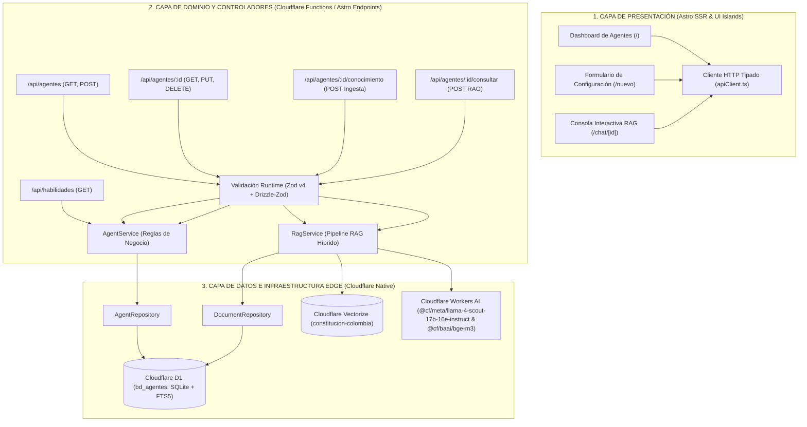

# Constitutional Agents (`constitutional-agents`)

> **Orquestador Serverless en el Edge de Agentes de Inteligencia Artificial especializados en Derecho Constitucional.**

[](https://opensource.org/licenses/MIT)
[](https://astro.build/)
[](https://workers.cloudflare.com/)
[](https://developers.cloudflare.com/workers/wrangler/)
[](https://orm.drizzle.team/)
[](https://tailwindcss.com/)
[](https://www.typescriptlang.org/)
[](https://zod.dev/)
[](https://pnpm.io/)

Sistema integral de gestión (CRUD), orquestación y consulta conversacional con Recuperación Aumentada por Generación (RAG) de Agentes de Inteligencia Artificial especializados en la **Constitución Política de Colombia de 1991**. Diseñado bajo principios de Clean Architecture y ejecutado al 100% en el borde (*Edge Computing*) sobre el ecosistema nativo de **Cloudflare** y **Astro**.

---

## 🏛️ Propósito y Enfoque Constitucional

El sistema modela y despliega agentes jurídicos cognitivos con instrucciones personalizadas, habilidades especializadas y corpus normativo constitucional ingerido (Principios Fundamentales, Derechos y Garantías, Participación Democrática y Acción de Tutela).

Cada agente opera con las siguientes capacidades:
1. **Asesoría Jurídica Fundamentada:** Responde consultas ciudadanas citando taxativamente los artículos y títulos aplicables de la Constitución de Colombia.
2. **Ingesta y Segmentación:** Procesa corpus en Markdown, divide el articulado en bloques semánticos y los persiste de manera sincronizada tanto en índices vectoriales como relacionales.
3. **Pipeline RAG Híbrido:** Combina recuperación vectorial semántica mediante **Cloudflare Vectorize** con búsqueda léxica a través de **SQLite FTS5** en **Cloudflare D1**.

---

## 📐 Arquitectura del Sistema

El sistema está concebido para operar sin servidores dedicados ni contenedores persistentes, desacoplando estrictamente responsabilidades en tres dimensiones:



---

### 1. Arquitectura de Software

La solución implementa un flujo unidireccional en 3 capas desacopladas:

1. **Capa de Presentación (Astro v7 + Tailwind CSS v4):**
   - Modo de salida del servidor: `output: 'server'` procesado en el Worker runtime (`@astrojs/cloudflare` v14).
   - Estilizado de última generación mediante `@tailwindcss/vite` sin hojas de cálculo heredadas ni preprocesadores externos.
   - Vistas modulares para visualización (`index.astro`), creación/edición (`nuevo.astro`) y chat conversacional (`chat/[id].astro`).
   - Abstracción de llamadas del cliente tipadas mediante `ApiClient`.

2. **Capa de Lógica de Negocio y Controladores REST:**
   - Controladores HTTP aislados bajo `src/pages/api/`.
   - Validación estricta en tiempo de ejecución con **Zod v4** y esquemas sincronizados vía **Drizzle-Zod**.
   - `AgentService`: Orquestación del ciclo de vida del agente, validación de slugs únicos y resolución de relaciones N:M con habilidades.
   - `RagService`: Ingesta documental, chunking por encabezados Markdown, generación de embeddings multilingües y estrategia de inferencia con fallback local determinista.

3. **Capa de Persistencia y Acceso a Datos (Repository Pattern):**
   - `AgentRepository`: Maneja operaciones sobre `agentes`, `habilidades` y la tabla asociativa `agente_habilidades`.
   - `DocumentRepository`: Abstrae la persistencia en `agente_documentos` y ejecuta búsquedas FTS5 en `fts_documentos`.

---

### 2. Arquitectura de Código

La organización del código fuente responde al principio de Responsabilidad Única y Arquitectura Limpia:

```text
constitutional-agents/
├── conocimiento/               # Corpus normativo constitucional (.md)
│   ├── titulo_1_principios.md  # Arts. 1 al 10 (Estado Social, Fines, Supremacía)
│   ├── titulo_2_derechos.md    # Arts. 11 al 86 (Vida, Igualdad, Tutela, Petición)
│   └── titulo_4_participacion.md # Art. 103 (Mecanismos de participación democrática)
├── database/                   # Definición DDL y semillas SQL de SQLite
│   ├── schema.sql              # Esquema relacional + triggers de sincronización FTS5
│   └── seed.sql                # Agente inicial 'constitucional-co' y catálogo maestro
├── docs/                       # Documentación técnica y especificaciones de diseño
│   ├── arquitectura.md         # Justificación arquitectónica y diagramas Mermaid
│   └── documentacion_api.md    # Contratos de API REST, códigos HTTP y payloads
├── src/
│   ├── components/             # Componentes Astro de interfaz
│   │   ├── AgentForm.astro     # Formulario reactivo para alta y edición
│   │   ├── AgentTable.astro    # Tabla de visualización y acciones CRUD
│   │   └── ChatInterface.astro # Interfaz de mensajería interactiva con streaming/RAG
│   ├── db/                     # Capa de base de datos relacional
│   │   ├── index.ts            # Fábrica del cliente Drizzle ORM sobre Cloudflare D1
│   │   └── schema.ts           # Definición de tablas y relaciones con Drizzle
│   ├── layouts/                # Plantillas maestras de navegación
│   │   └── Layout.astro        # Layout base con soporte responsive y metaetiquetas
│   ├── lib/                    # Utilidades de entorno
│   │   └── env.ts              # Inyección y tipado del runtime Cloudflare en Astro
│   ├── pages/
│   │   ├── api/                # Controladores HTTP de la API REST
│   │   │   ├── agentes/
│   │   │   │   ├── [id]/
│   │   │   │   │   ├── conocimiento.ts # Ingesta y vectorización de documentos
│   │   │   │   │   ├── consultar.ts    # Consulta conversacional con RAG
│   │   │   │   │   └── index.ts        # GET por ID, PUT actualización, DELETE en cascada
│   │   │   │   └── index.ts            # GET listado general, POST registro de agente
│   │   │   └── habilidades.ts          # GET catálogo global de habilidades
│   │   ├── chat/[id].astro     # Consola de chat interactiva
│   │   ├── index.astro         # Vista de inicio (Dashboard de agentes)
│   │   └── nuevo.astro         # Vista de registro de nuevo agente
│   ├── repositories/           # Patrón Repositorio para acceso a datos
│   │   ├── agent.repository.ts
│   │   └── document.repository.ts
│   ├── schemas/                # Validación de contratos y DTOs con Zod
│   │   ├── agent.schema.ts     # Esquemas de entrada/salida de agentes y habilidades
│   │   └── chat.schema.ts      # Esquemas para consultas y respuestas RAG
│   ├── services/               # Lógica de negocio y orquestación RAG
│   │   ├── agent.service.ts
│   │   ├── rag.service.ts
│   │   └── client/             # Cliente HTTP para el frontend
│   │       └── apiClient.ts
│   └── styles/
│       └── global.css          # Directivas globales de Tailwind CSS v4
├── astro.config.mjs            # Configuración Astro SSR con adaptador Cloudflare y Vite Tailwind
├── drizzle.config.ts           # Configuración de migraciones para Drizzle Kit
├── package.json                # Dependencias con versiones exactas y scripts pnpm
├── pnpm-lock.yaml              # Lockfile inmutable de dependencias
├── test-suite.mjs              # Suite automatizada de pruebas HTTP y validación de endpoints
├── tsconfig.json               # Configuración estricta de TypeScript
└── wrangler.jsonc              # Definición de infraestructura como código (Cloudflare D1, AI, Vectorize)
```

---

### 3. Arquitectura de Infraestructura (Cloudflare Edge Native)

El sistema se ejecuta completamente sobre el borde global de Cloudflare:

| Recurso | Identificador / Binding | Modelo / Versión | Propósito Arquitectónico |
| :--- | :--- | :--- | :--- |
| **Compute Engine** | Astro SSR Worker | Node.js Compat (`2024-09-23`) | Ejecución serverless de la UI y los endpoints REST con latencia mínima global. |
| **Base de Datos Relacional** | `DB` (`bd_agentes`) | Cloudflare D1 (SQLite) | Persistencia ACID de agentes, habilidades, documentos y triggers FTS5. |
| **Índice Vectorial** | `VECTOR_INDEX` (`constitucion-colombia`) | Cloudflare Vectorize | Búsqueda por similitud vectorial (Cosine Distance) sobre representaciones semánticas. |
| **Generación LLM** | `AI` | `@cf/meta/llama-4-scout-17b-16e-instruct` | Modelo fundacional para redacción de dictámenes jurídicos fundamentados. |
| **Modelo de Embeddings** | `AI` | `@cf/baai/bge-m3` | Vectorización multilingüe de alta dimensionalidad para fragmentos de texto normativo. |

---

## 🗄️ Modelo de Datos y Búsqueda FTS5

El esquema relacional implementa integridad referencial y búsqueda léxica acelerada:

```sql
agentes (
    id INTEGER PRIMARY KEY AUTOINCREMENT,
    slug VARCHAR(60) NOT NULL UNIQUE,
    nombre VARCHAR(100) NOT NULL,
    rol VARCHAR(100) NOT NULL,
    modelo VARCHAR(80) NOT NULL DEFAULT '@cf/meta/llama-4-scout-17b-16e-instruct',
    temperatura REAL NOT NULL DEFAULT 0.2,
    system_prompt TEXT NOT NULL,
    activo INTEGER NOT NULL DEFAULT 1,
    created_at DATETIME DEFAULT CURRENT_TIMESTAMP
);

habilidades (
    id INTEGER PRIMARY KEY AUTOINCREMENT,
    codigo VARCHAR(50) NOT NULL UNIQUE,
    nombre VARCHAR(100) NOT NULL,
    descripcion TEXT
);

agente_habilidades (
    agente_id INTEGER NOT NULL REFERENCES agentes(id) ON DELETE CASCADE,
    habilidad_id INTEGER NOT NULL REFERENCES habilidades(id) ON DELETE CASCADE,
    PRIMARY KEY (agente_id, habilidad_id)
);

agente_documentos (
    id INTEGER PRIMARY KEY AUTOINCREMENT,
    agente_id INTEGER NOT NULL REFERENCES agentes(id) ON DELETE CASCADE,
    vector_id VARCHAR(64),
    nombre_archivo VARCHAR(150) NOT NULL,
    titulo_seccion VARCHAR(200) NOT NULL,
    contenido TEXT NOT NULL,
    created_at DATETIME DEFAULT CURRENT_TIMESTAMP
);

-- Tabla virtual para indexación full-text
fts_documentos USING fts5(documento_id UNINDEXED, agente_id UNINDEXED, titulo_seccion, contenido);
```

> **Sincronización Automática:** Tres triggers de base de datos (`trg_documentos_insert`, `trg_documentos_update`, `trg_documentos_delete`) mantienen la tabla virtual `fts_documentos` sincronizada en tiempo real con `agente_documentos`.

---

## 🔄 Pipeline RAG Constitucional Híbrido

1. **Ingesta de Conocimiento:**
   - La función `splitMarkdownIntoSections` detecta títulos (`#` y `##`) para crear unidades semánticas por artículo o sección.
   - Si el enlace a Workers AI y Vectorize está activo, se calculan embeddings multilingües mediante `@cf/baai/bge-m3` y se envían a Vectorize con metadatos asociados (`agente_id`, `titulo`, `archivo`).
   - El fragmento se inserta en `agente_documentos`, disparando el trigger hacia `fts_documentos`.

2. **Recuperación Híbrida (`retrieveContext`):**
   - **Paso 1 (Semántico):** Se vectoriza la consulta del usuario y se extraen los fragmentos más cercanos (`topK: 3`) desde Vectorize filtrados por `agente_id`.
   - **Paso 2 (Léxico):** Se ejecuta búsqueda FTS5 en D1 para capturar coincidencias normativas directas (ej. menciones de "Artículo 86" o "Tutela").
   - **Paso 3 (Deduplicación):** Se fusionan los resultados eliminando duplicados mediante títulos normalizados.
   - **Paso 4 (Resiliencia):** En caso de no existir coincidencias vectoriales o léxicas, se inyectan los documentos más recientes asociados al agente.

3. **Inferencia y Fundamentación:**
   - Se inyecta un *system prompt* que obliga al modelo a ceñirse exclusivamente al marco constitucional provisto y citar explícitamente los artículos aplicables.
   - Inferencia ejecutada con `@cf/meta/llama-4-scout-17b-16e-instruct` a baja temperatura (`0.2` por defecto).
   - En entornos locales o sin credenciales de Cloudflare, `RagService` cuenta con un motor de inferencia simulada determinista que valida el flujo de extremo a extremo sin interrumpir el desarrollo.

---

## 📡 Matriz de API REST

| Método | Endpoint | Acción | Códigos HTTP |
| :--- | :--- | :--- | :--- |
| `GET` | `/api/agentes` | Listar todos los agentes registrados junto a sus habilidades | `200` |
| `POST` | `/api/agentes` | Registrar un nuevo agente y asociar sus habilidades iniciales | `201`, `400`, `409` |
| `GET` | `/api/agentes/:id` | Obtener el detalle de un agente y sus documentos asociados | `200`, `404` |
| `PUT` | `/api/agentes/:id` | Modificar configuración, parámetros o habilidades de un agente | `200`, `400`, `404`, `409` |
| `DELETE` | `/api/agentes/:id` | Eliminar agente y sus dependencias en cascada | `200`, `404` |
| `POST` | `/api/agentes/:id/conocimiento` | Ingestar documento Markdown, chunking y vectorización | `201`, `400`, `404` |
| `POST` | `/api/agentes/:id/consultar` | Ejecutar consulta RAG híbrida contra el agente | `200`, `400`, `404` |
| `GET` | `/api/habilidades` | Consultar el catálogo maestro de habilidades disponibles | `200` |

---

## 📦 Stack Tecnológico y Versiones

| Paquete / Herramienta | Versión | Rol |
| :--- | :--- | :--- |
| **Astro** | `^7.3.2` | Framework SSR de alto rendimiento |
| **@astrojs/cloudflare** | `^14.3.1` | Adaptador oficial para Cloudflare Workers/Pages |
| **Cloudflare Wrangler** | `^4.132.0` | CLI y emulador local de servicios Cloudflare |
| **Drizzle ORM** | `^0.45.2` | ORM TypeScript para Cloudflare D1 (SQLite) |
| **Drizzle Kit** | `^0.31.10` | Herramienta de generación y ejecución de migraciones |
| **Tailwind CSS** | `^4.3.3` | Motor de estilos utility-first moderno |
| **@tailwindcss/vite** | `^4.3.3` | Integración nativa de Tailwind v4 en Vite |
| **Zod** | `^4.6.5` | Validación de tipos y contratos en runtime |
| **Drizzle Zod** | `^0.8.3` | Generación de esquemas Zod a partir de tablas Drizzle |
| **TypeScript** | `^6.0.3` | Tipado estático estricto |
| **Node.js** | `>= 20` (probado en `v24.15.0`) | Entorno de ejecución local |
| **pnpm** | `>= 9` (probado en `v11.20.0`) | Gestor de paquetes obligatorio y exclusivo |

---

## 🚀 Instalación y Puesta en Marcha

### Prerrequisitos
- **Node.js** v20+ instalado.
- **pnpm** instalado globalmente (`npm i -g pnpm` o `corepack enable`).

### 1. Clonar el repositorio
```bash
git clone https://github.com/SantiagoPrada2005/constitutional-agents.git
cd constitutional-agents
```

### 2. Instalar dependencias
> **Nota obligatoria de workspace:** Únicamente debe utilizarse `pnpm`. No use `npm` ni `yarn`.
```bash
pnpm install
```

### 3. Inicializar la base de datos D1 local
```bash
# Aplicar esquema relacional y triggers FTS5
pnpm db:migrate

# Cargar habilidades del catálogo y el agente constitucional inicial
pnpm db:seed
```

### 4. Iniciar el entorno de desarrollo
```bash
pnpm dev
```
La aplicación estará disponible en `http://localhost:4321`.

### 5. Ejecutar la batería de pruebas
```bash
pnpm test
```

---

## 👤 Autor

**Santiago Prada**
- GitHub: [@SantiagoPrada2005](https://github.com/SantiagoPrada2005)
- Email: [santiagoprada@gmail.com](mailto:santiagoprada@gmail.com)

---

## 📄 Licencia

Este proyecto está bajo la **Licencia MIT**. Consulta el archivo [LICENSE](LICENSE) para más detalles.
