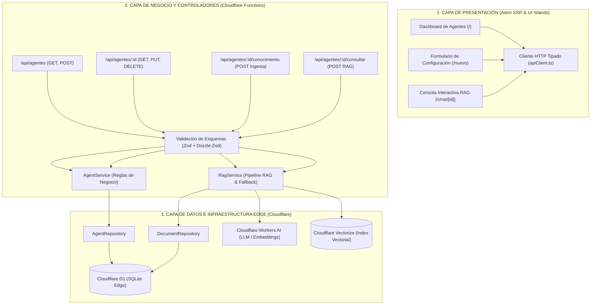

# Constitutional Agents (`constitutional-agents`)

> **Orquestador Edge Serverless de Agentes de Inteligencia Artificial especializados en Derecho Constitucional.**

[](https://opensource.org/licenses/MIT)
[](https://astro.build/)
[](https://workers.cloudflare.com/)
[](https://orm.drizzle.team/)
[](https://tailwindcss.com/)
[](https://www.typescriptlang.org/)
[](https://pnpm.io/)

Sistema integral de gestión (CRUD), orquestación y consulta conversacional (RAG) de Agentes de Inteligencia Artificial especializados en la **Constitución Política de Colombia de 1991**. Diseñado bajo principios de Clean Architecture y ejecutado al 100% en el borde (*Edge Computing*) mediante el ecosistema de **Cloudflare** y **Astro SSR**.

---

## 🏛️ Propósito y Enfoque Constitucional

El sistema permite configurar agentes cognitivos con instrucciones personalizadas, asignación de habilidades y vinculación de corpus normativos constitucionales (Principios Fundamentales, Derechos y Garantías, Participación Democrática). 

Cada agente opera como un asistente jurídico especializado con capacidad de:
1. Analizar consultas ciudadanas y jurídicas fundamentándose en artículos constitucionales precisos.
2. Ingestar y vectorizar fragmentos de la Constitución y jurisprudencia asociada.
3. Ejecutar pipelines de Recuperación Aumentada por Generación (RAG) con trazabilidad y citas exactas de fuentes primarias.

---

## 📐 Arquitectura del Sistema

El diseño se estructura desacoplando estrictamente responsabilidades en tres dimensiones: **Software**, **Código** e **Infraestructura**.



### 1. Arquitectura de Software (3 Capas)

1. **Capa de Presentación (Astro 5 SSR & Tailwind CSS v4):**
   - Renderizado del lado del servidor (SSR) en milisegundos con hidratación selectiva.
   - Componentes modulares (`AgentForm`, `AgentTable`, `ChatInterface`, `Layout`).
   - Interfaz reactiva y optimizada para accesibilidad, diseño adaptable y tipografía clara.
   - Cliente HTTP tipado (`apiClient.ts`) para comunicación asíncrona robusta.

2. **Capa de Dominio y Controladores REST:**
   - Endpoints modulares en `src/pages/api/` que actúan como controladores HTTP.
   - Validación estricta de esquemas y DTOs en tiempo de ejecución con **Zod** y **Drizzle-Zod**.
   - Servicios de dominio desacoplados (`AgentService` y `RagService`) que concentran la lógica de orquestación, reglas de negocio y políticas de fallback.

3. **Capa de Persistencia y Recuperación Semántica:**
   - Patrón Repositorio (`AgentRepository`, `DocumentRepository`) para aislar la base de datos de los casos de uso.
   - Soporte híbrido: persistencia relacional transaccional en **Cloudflare D1** y persistencia vectorial indexada en **Cloudflare Vectorize**.

---

### 2. Arquitectura de Código (Clean Architecture & Modular Structure)

La organización de directorios sigue una separación estricta de responsabilidades:

```text
constitutional-agents/
├── conocimiento/               # Corpus normativo constitucional (.md)
│   ├── titulo_1_principios.md
│   ├── titulo_2_derechos.md
│   └── titulo_4_participacion.md
├── database/                   # Definición DDL y semillas SQL
│   ├── schema.sql
│   └── seed.sql
├── docs/                       # Especificaciones técnicas detalladas
│   ├── arquitectura.md
│   └── documentacion_api.md
├── src/
│   ├── components/             # Componentes de presentación (Astro)
│   │   ├── AgentForm.astro
│   │   ├── AgentTable.astro
│   │   └── ChatInterface.astro
│   ├── db/                     # Esquemas relacionales y conexión D1
│   │   ├── index.ts
│   │   └── schema.ts
│   ├── layouts/                # Layouts globales de página
│   │   └── Layout.astro
│   ├── lib/                    # Helpers, contexto de entorno Cloudflare
│   │   └── env.ts
│   ├── pages/                  # Rutas de vistas y API REST (SSR)
│   │   ├── api/
│   │   │   ├── agentes/        # Endpoints CRUD de agentes
│   │   │   │   ├── [id]/
│   │   │   │   │   ├── conocimiento.ts
│   │   │   │   │   ├── consultar.ts
│   │   │   │   │   └── index.ts
│   │   │   │   └── index.ts
│   │   │   └── habilidades.ts  # Catálogo de habilidades
│   │   ├── chat/[id].astro     # Consola de chat RAG
│   │   ├── index.astro         # Dashboard principal
│   │   └── nuevo.astro         # Formulario de alta/edición
│   ├── repositories/           # Capa de acceso a datos (Patrón Repository)
│   │   ├── agent.repository.ts
│   │   └── document.repository.ts
│   ├── schemas/                # Validación y DTOs (Zod)
│   │   ├── agent.schema.ts
│   │   └── chat.schema.ts
│   ├── services/               # Lógica de negocio y pipelines RAG
│   │   ├── agent.service.ts
│   │   ├── rag.service.ts
│   │   └── client/             # Cliente HTTP cliente
│   │       └── apiClient.ts
│   └── styles/
│       └── global.css          # Estilos globales con Tailwind v4
├── astro.config.mjs            # Configuración de Astro con adapter Cloudflare
├── drizzle.config.ts           # Configuración de Drizzle Kit
├── package.json                # Dependencias y scripts del proyecto
├── pnpm-lock.yaml              # Lockfile estricto (pnpm)
├── test-suite.mjs              # Suite de pruebas E2E y de integración
├── tsconfig.json               # Configuración TypeScript estricta
└── wrangler.jsonc              # Manifiesto de infraestructura Cloudflare
```

---

### 3. Arquitectura de Infraestructura (Cloudflare Edge Native)

El sistema opera bajo un paradigma **100% Serverless en el Edge**, eliminando la necesidad de servidores dedicados o contenedores permanentes:

| Componente | Tecnología | Rol en la Arquitectura |
| :--- | :--- | :--- |
| **Compute / Routing** | Cloudflare Pages / Workers | Ejecución distribuida a nivel global con tiempos de arranque cercanos a 0 ms. |
| **Relational Database** | Cloudflare D1 | Base de datos SQLite distribuida globalmente para agentes, configuraciones y documentos. |
| **Vector Database** | Cloudflare Vectorize | Índice vectorial de alta dimensión optimizado para búsqueda semántica por similitud coseno. |
| **AI Inference** | Cloudflare Workers AI | Ejecución de modelos de embeddings (`@cf/baai/bge-base-en-v1.5`) y generación de texto (`@cf/meta/llama-3-8b-instruct`). |
| **ORM & Type Safety** | Drizzle ORM | Abstracción tipada de consultas SQL sin sobrecarga de runtime. |

---

## 🔄 Pipeline RAG Constitucional

El flujo de procesamiento semántico garantiza precisión jurídica:

1. **Ingesta y Segmentación:**
   - El documento constitucional se fragmenta en *chunks* semánticos (artículos, parágrafos).
   - Se generan embeddings vectoriales a través de Cloudflare Workers AI.
   - El contenido se indexa en **Vectorize** y los metadatos relacionales se almacenan en **D1**.
2. **Recuperación Semántica:**
   - La pregunta del usuario se vectoriza en tiempo de ejecución.
   - Se consulta Vectorize para recuperar los fragmentos con mayor similitud semántica.
   - *Fallback de resiliencia:* si el índice vectorial no está disponible, el sistema consulta los documentos relacionales en D1 por correspondencia temática.
3. **Generación con Cita Normativa:**
   - Se inyectan el *prompt* de sistema del agente, las habilidades activas y el contexto normativo recuperado.
   - El LLM genera una respuesta fundamentada citando explícitamente los artículos constitucionales pertinentes.

---

## 📡 Matriz de API REST

| Método | Endpoint | Descripción | Códigos HTTP |
| :--- | :--- | :--- | :--- |
| `GET` | `/api/agentes` | Lista todos los agentes y sus habilidades | `200` |
| `POST` | `/api/agentes` | Registra un nuevo agente con sus habilidades | `201`, `400`, `409` |
| `GET` | `/api/agentes/:id` | Detalle de un agente y documentos asociados | `200`, `404` |
| `PUT` | `/api/agentes/:id` | Actualiza parámetros de configuración del agente | `200`, `400`, `404`, `409` |
| `DELETE`| `/api/agentes/:id` | Elimina un agente y sus dependencias en cascada | `200`, `404` |
| `POST` | `/api/agentes/:id/conocimiento` | Ingesta y vectoriza un documento Markdown | `201`, `400`, `404` |
| `POST` | `/api/agentes/:id/consultar` | Ejecuta consulta conversacional mediante RAG | `200`, `400`, `404` |
| `GET` | `/api/habilidades` | Lista catálogo global de habilidades disponibles | `200` |

---

## 🚀 Instalación y Puesta en Marcha

### Prerrequisitos
- [Node.js](https://nodejs.org/) (versión 20 o superior recomendada)
- [pnpm](https://pnpm.io/) (gestor de paquetes exclusivo obligatorio para este proyecto)
- [Wrangler CLI](https://developers.cloudflare.com/workers/wrangler/) (incluido en `devDependencies`)

### 1. Clonar el repositorio
```bash
git clone https://github.com/SantiagoPrada2005/constitutional-agents.git
cd constitutional-agents
```

### 2. Instalar dependencias
```bash
pnpm install
```

### 3. Aplicar migraciones y datos semilla en D1 local
```bash
# Aplicar migraciones a la base de datos SQLite local de Cloudflare D1
pnpm db:migrate

# Cargar habilidades y agentes semilla iniciales
pnpm db:seed
```

### 4. Iniciar servidor de desarrollo
```bash
pnpm dev
```
La aplicación estará disponible en `http://localhost:4321`.

### 5. Ejecutar suite de pruebas
```bash
pnpm test
```

---

## 👤 Autor

**Santiago Prada**
- GitHub: [@SantiagoPrada2005](https://github.com/SantiagoPrada2005)
- Email: [santiagoprada@gmail.com](mailto:santiagoprada@gmail.com)

---

## 📄 Licencia

Este proyecto está licenciado bajo los términos de la **Licencia MIT**. Consulta el archivo [LICENSE](LICENSE) para más detalles.
