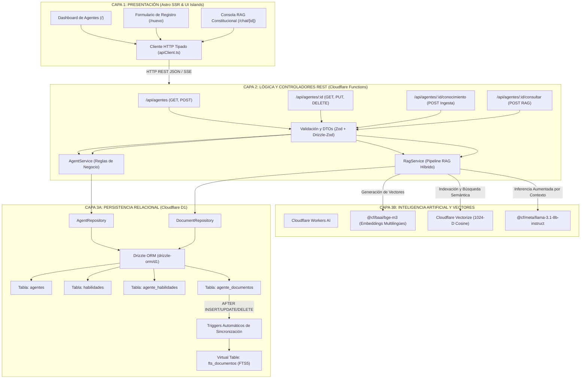

# Arquitectura del Sistema: Orquestador Serverless Edge de Agentes Constitucionales

Documento de justificación y especificación arquitectónica del sistema de gestión y consulta de Agentes de IA en el borde (Edge Computing) con Astro y Cloudflare.

---

## 1. Diagrama de Arquitectura de 3 Capas

---

## 2. Principios de Diseño de Software

### 2.1. Desacoplamiento Estricto
1. **Frontend Desacoplado:** Las vistas Astro y componentes interactivos nunca acceden directamente a sentencias SQL ni bindings de Cloudflare. Toda interacción se realiza a través de `apiClient.ts` consumiendo la API REST mediante `fetch()`.
2. **Repository Pattern:** Las consultas D1 y sentencias Drizzle quedan confinadas en `src/repositories/`. Los controladores HTTP ignoran la estructura de base de datos subyacente.
3. **Service Layer Pattern:** La validación de negocio (unicidad de slugs, restricciones de integridad referencial, sanitización) y la orquestación del RAG se encapsulan en `src/services/`.
4. **Thin Controllers:** Los endpoints en `src/pages/api/` se limitan a recibir el request, validar el payload con Zod, delegar al servicio y emitir el código de respuesta HTTP correspondiente.

### 2.2. Flujo RAG Híbrido en el Borde
- **Búsqueda Semántica (Vectorize):** Genera embeddings con `@cf/baai/bge-m3` y busca vectores afines por similitud coseno.
- **Búsqueda Léxica (D1 FTS5):** Cuando el usuario menciona términos o números de artículo exactos (ej. "Artículo 86", "Tutela"), el motor ejecuta consultas de texto completo optimizadas sobre `fts_documentos`.
- **Inferencia Grounded (Workers AI):** El contexto recuperado de ambas fuentes se inyecta en el prompt del sistema de `@cf/meta/llama-3.1-8b-instruct`, garantizando que el agente justifique su respuesta con la base normativa constitucional sin alucinaciones.
